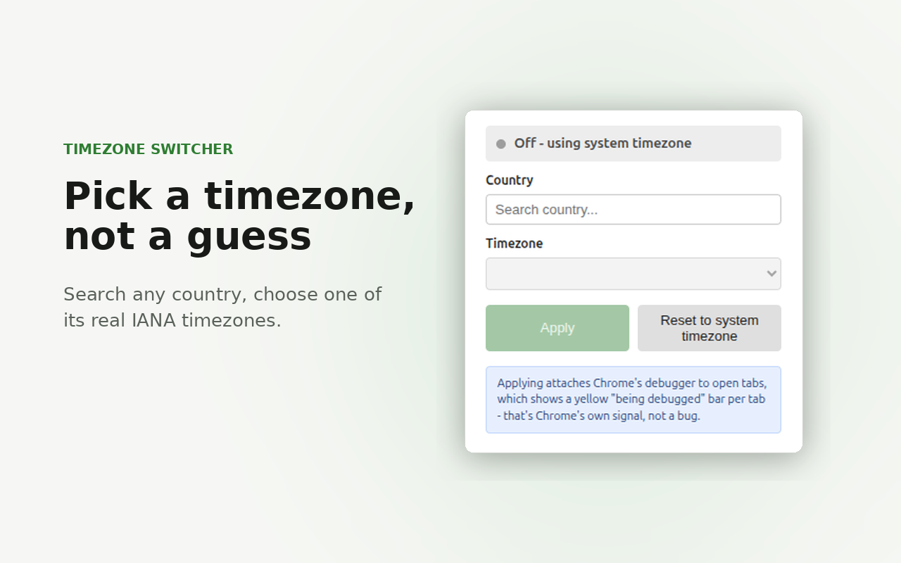
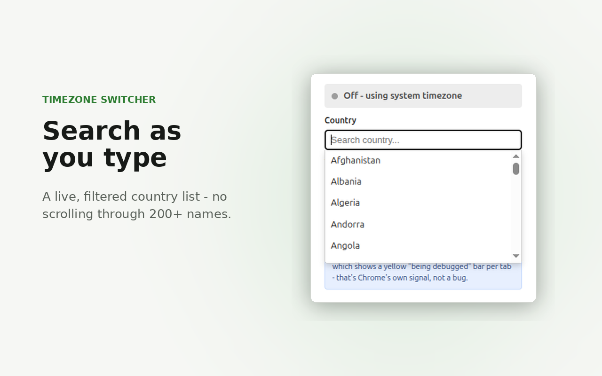
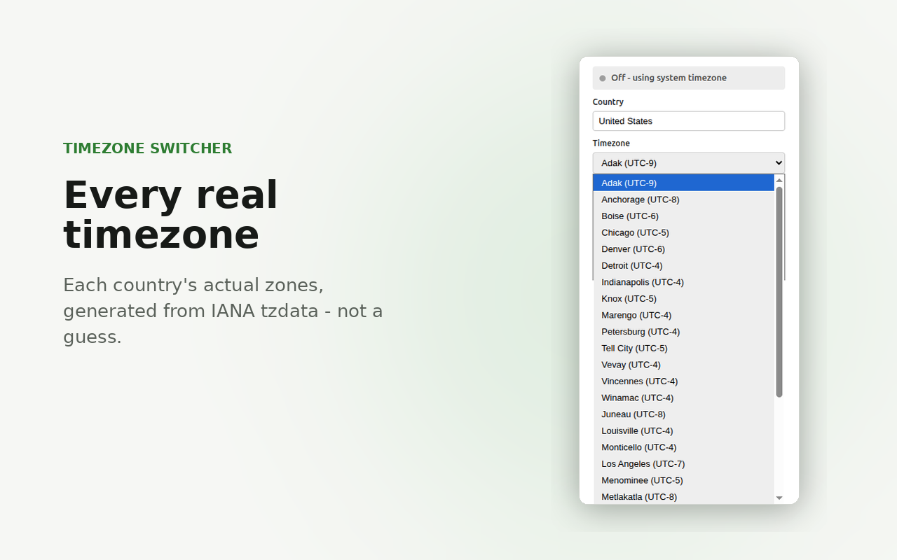
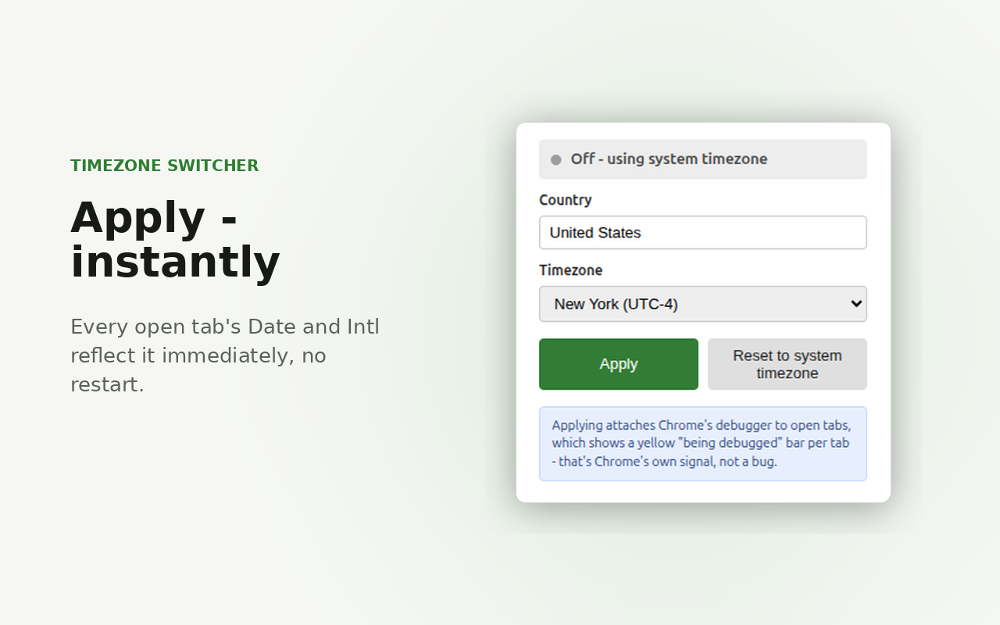

# Timezone Switcher

Chrome extension to override a tab's effective timezone - pick a country,
pick one of its timezones, that tab's `Date`/`Intl` reflects it
immediately.

## Install

[link-chrome]: https://chromewebstore.google.com/detail/timezone-switcher/jfhlfigbpompllkhhknaekjadehgajdm 'Version published on Chrome Web Store'

[][link-chrome] [][link-chrome] [Install for Chrome][link-chrome]

## Usage

1. On the tab you want to override, click the extension icon, search a
   country, pick a timezone, **Apply**.
2. **Reset to system timezone** to go back to normal.

Only the tab that was active when you clicked Apply is affected - applying
again from a different tab moves the override there. Applying attaches
Chrome's debugger to that tab, which shows a yellow "being debugged" bar -
that's Chrome's own signal, not a bug, and it stays until you reset.

## Screenshots

  
  

  
  

